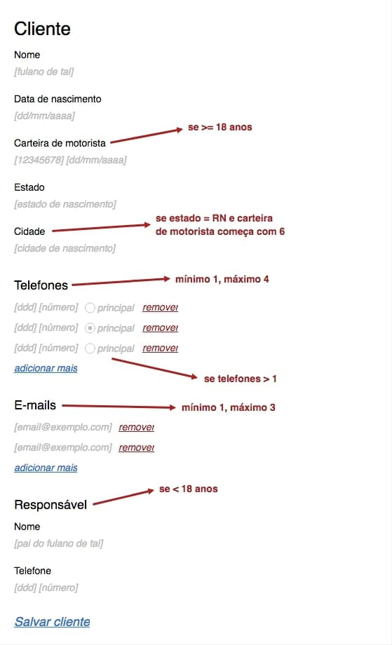
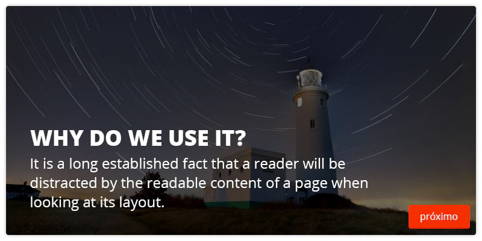
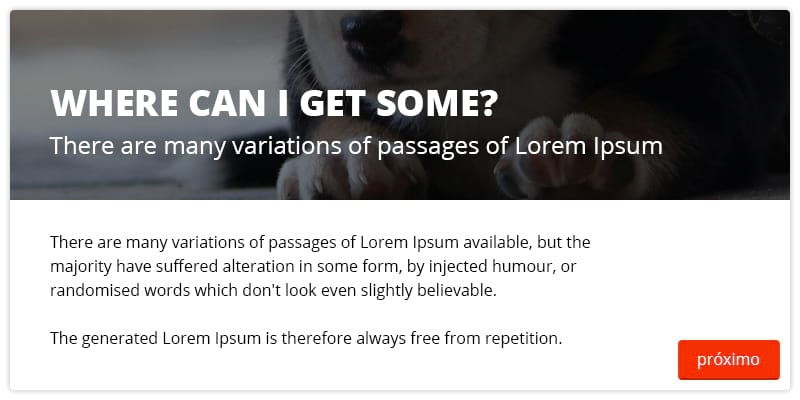
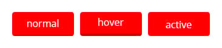

# Credere

Para mais informações sobre a vaga, [acesse a nossa página no Hipsters.jobs](https://hipsters.jobs/company/672/credere/).

## 1. Primeira parte

### Um formulário

Implementar, estilizar e melhorar a experiência do formulário ilustrado abaixo, usando as regras apresentadas na imagem.

Em suma, todos os campos devem ser obrigatórios, com excessão dos marcados com vermelho, que devem ser obrigatórios quando suas condições forem satisfeitas.



Alguns exemplos de respostas mocks de uma API estão disponíveis em `/server`.

#### 1.1. Criação

Campos:

```js
customer['name']
customer['birthday']

customer['driver_license']['number']
customer['driver_license']['issued_at']

customer['state']
customer['city']

customer['phones'][0]['code']
customer['phones'][0]['number']
customer['phones'][0]['main']

customer['phones'][1]['code']
customer['phones'][1]['number']
customer['phones'][1]['main']

customer['emails'][0]['address']

customer['emails'][1]['address']

customer['parent']['name']
customer['parent']['phone']['code']
customer['parent']['phone']['number']
```

#### 1.2. Edição

Mesmos campos e regras da criação, com a adição de alguns hiddens nos relacionamentos:

- `__id` pra identificar o item; e
- um boolean `__destroy` pra identificar se ele deve ser removido ou não.

```js
customer['phones'][0]['__id']
customer['phones'][0]['__destroy']

customer['emails'][0]['__id']
customer['emails'][0]['__destroy']

customer['driver_license']['__destroy']

customer['parent']['__destroy']
```

## 2. Parte dois

### Um leitor de novidades :)

#### 2.1. Implementação

A ideia é que um slider seja criado para apresentar novidades no sistema. Algumas regras são:

- se aproximar ao máximo do design apresentado nas imagens abaixo;
- a leitura de todas as páginas ser obrigatória;
- os slides com texto não devem apresentar scroll interno ou trim nos parágrafos;
- todos os slides devem ter a mesma altura; e
- ele deve ser alimentado por um JSON: a ideia é que se possa escolher nesse arquivo o layout, imagem e textos de cada slide.







Os botões devem obedecer, pelo menos, aos seguintes estados:



*BÔNUS: Conseguir fazer o botão de "próximo" mudar o slide sem usar JavaScript :)*

## 3. Pronto. E agora?

#### 3.1. Ganhe uns pontos extras

- se preocupando com imagens de background sem contraste;
- se preocupando com diferentes tamanhos de tela; e
- configurando um deploy automático.

### 3.2. Testes

Teste. Seu. Código. :D

#### 3.2. E pra rodar, cmofas?

Não esqueça de documentar bem esse passo!

#### 3.4. Envia tudo!

`#partiu` subir o projeto no GitHub ~~e deployar, talvez? ;)~~ pra que a gente consiga avaliar seu código. Se não quiser deixar público, pode enviar direto pra gente.

## 4. That's it!

Usamos frameworks no dia-a-dia, mas valorizamos bastante o domínio de fundamentos e do conhecimento de base. Esses são os pontos que mais nos chamam atenção.

Fique a vontade pra usar o que quiser de tecnologia no projeto.

Qualquer dúvida, dispara um e-mail pra gente no [credev@meucredere.com.br](mailto:credev@meucredere.com.br).
