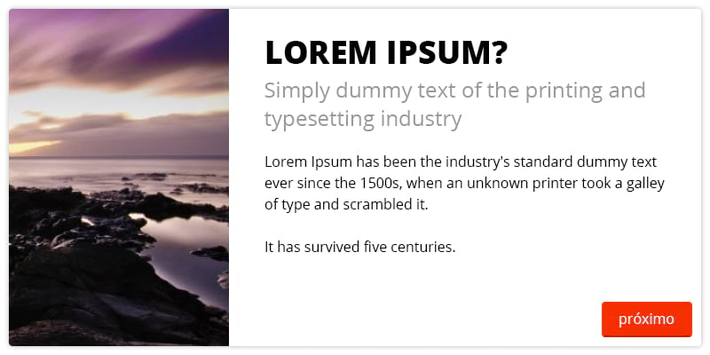

# Credere

Para mais informações sobre a vaga, [acesse a nossa página no Hipsters.jobs](https://hipsters.jobs/company/672/credere/).

## 1. Primeira parte

### Um formulário

Implementar, estilizar e melhorar a experiência do formulário ilustrado abaixo, usando as regras apresentadas na imagem.

Em suma, todos os campos devem ser obrigatórios, com excessão dos marcados com vermelho, que devem ser obrigatórios quando suas condições forem satisfeitas.


Alguns exemplos de respostas mocks de uma API estão disponíveis em `/server`.

#### 1.1. Criação

Campos:

```js
customer['name']
customer['birthday']

customer['driver_license']['number']
customer['driver_license']['issued_at']

customer['state']
customer['city']

customer['phones'][0]['code']
customer['phones'][0]['number']
customer['phones'][0]['main']

customer['phones'][1]['code']
customer['phones'][1]['number']
customer['phones'][1]['main']

customer['emails'][0]['address']

customer['emails'][1]['address']

customer['parent']['name']
customer['parent']['phone']['code']
customer['parent']['phone']['number']
```

#### 1.2. Edição

Mesmos campos e regras da criação, com a adição de alguns hiddens nos relacionamentos:

- `__id` pra identificar o item; e
- um boolean `__destroy` pra identificar se ele deve ser removido ou não.

```js
customer['phones'][0]['__id']
customer['phones'][0]['__destroy']

customer['emails'][0]['__id']
customer['emails'][0]['__destroy']

customer['driver_license']['__destroy']

customer['parent']['__destroy']
```

## 2. Parte dois

### Um leitor de novidades :)

#### 2.1. Implementação

A ideia é que um "slideshow" seja criado para apresentar novidades no sistema. Algumas regras são:

- se aproximar ao máximo do layout apresentado nas imagens;
- a leitura de todas as páginas é obrigatória;
- os layouts com texto não devem apresentar scroll interno ou trim nos parágrafos;
- todos os slides devem ter a mesma altura;
- o slideshow deve ser alimentado por JSON e a ideia é que se possa escolher o layout, imagem e textos de cada slide; e
- modificações no layout geral ou dos slides pra melhoria de experiência são bem-vindas. Novos layouts também.

Pelo menos 4 layouts de apresentação são obrigatórios:




Os botões devem obedecer pelo menos aos seguintes estados:


*BÔNUS: Consegue fazer o botão de "próximo" mostrar o próximo slide sem usar JavaScript? Algo mais? :)*

## 3. Pronto. E agora?

#### 3.1. Ganhe uns pontos extras

- se preocupando com imagens sem contraste e placeholders;
- se preocupando com diferentes tamanhos de tela; e
- desenrolando um deploy automático pra mostrar um skillset seu mais interessante ainda pra gente.

### 3.2. Testes

Teste. Seu. Código. :D

#### 3.2. E pra rodar, cmofas?

Não esqueça de documentar bem seu projeto.

#### 3.4. Envia tudo!

`#partiu` subir o projeto no GitHub ~~e deployar, talvez? ;)~~ pra que a gente consiga avaliar ele e seu código. Se não quiser deixar público, pode enviar direto pra gente.

## 4. That's it!

Usamos frameworks no dia-a-dia, mas valorizamos bastante o domínio de fundamentos e do conhecimento de base. Esses são os pontos que mais nos chamam atenção.

Fique a vontade pra usar o que quiser de tecnologia no projeto.

Qualquer dúvida, dispara um e-mail pra gente no [credev@meucredere.com.br](mailto:credev@meucredere.com.br).

